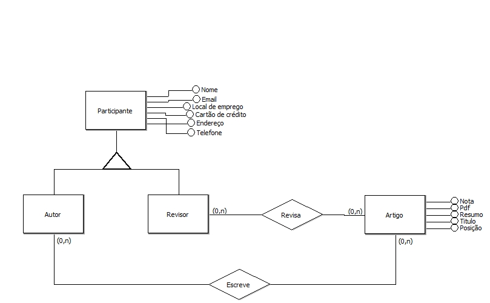

### Overview

Modelagem conceitual trata de uma _abstração semântica de softwares_, descrevendo modelos de estrutura de entidade e relacionamentos para criar uma espécie de "mapa" comportamental ou funcional.

### Entidades

Com a modelagem conceitual é facíl a visualização das entidades que serão criadas e quais atributos vai conter em cada, com isso podemos validar seu comportamento e relacionamentos.

* Participantes
* Autor
* Revisor
* Artigo

### Ações

Ações feitas entre as entidades fica mais facíl a visualização com isso sabemos que uma entidade como *revisor* tem com uma ação revisar um artigo e um autor de escrever.

* Revisa
* Escreve

### Ferramenta

Utilizamos o BRModelo para gerar nosso modelo conceitual, criado por <strong>Carlos Henrique Candido
, Ronaldo dos Santos Mello</strong>.

Publicação do [BRModelo](http://www.sis4.com/brModelo/brModelo.pdf)
