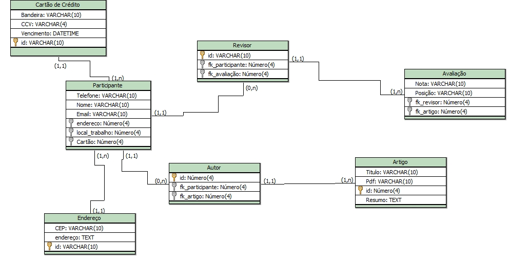

### Overview

O modelo lógico já leva em conta algumas limitações e implementa recursos como adequação de padrão e nomenclatura, define as chaves primárias e estrangeiras, normalização, integridade referencial, entre outras. Para o modelo lógico deve ser criado levando em conta os exemplos de modelagem de dados criados no modelo conceitual. - [Blog do Luis](https://www.luis.blog.br/modelagem-de-dados-modelo-conceitual-modelo-logico-e-fisico.html)

### Diagrama

Nosso diagrama foi feito com base no software do BRModelo facilitando a nossa geração dos schemas sql para criação do nosso banco de dados, foram identificados sete tabelas para a composição da nossa database;

* Cartão
* Participante
* Revisor
* Autor
* Endereço
* Artigo
* Avaliação

Passamos pelo processo também de normalização dos dados e criação de tabelas que seria importante para o processo da aplicação.

### Ferramenta utilizada

Utilizamos o BRModelo para gerar nosso modelo lógico e schema do mesmo, criado por <strong>Carlos Henrique Candido e Ronaldo dos Santos Mello</strong>.

Publicação do [BRModelo](http://www.sis4.com/brModelo/brModelo.pdf)
